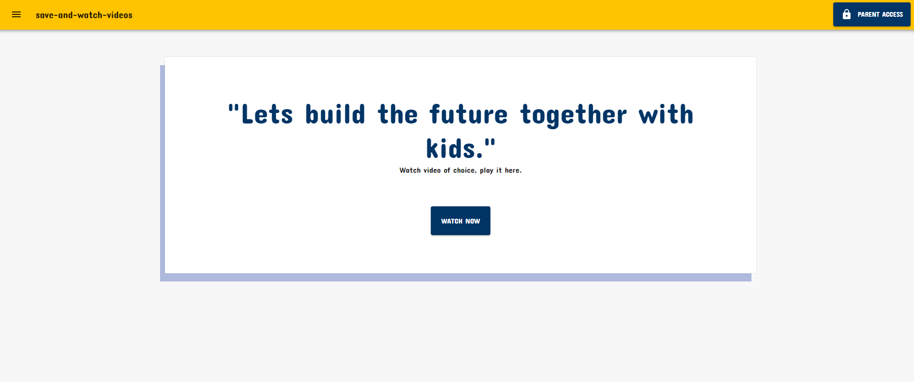
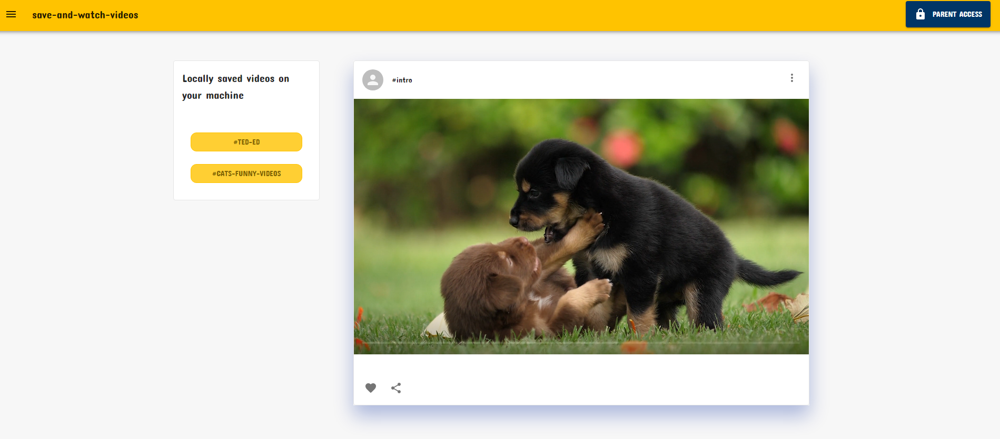
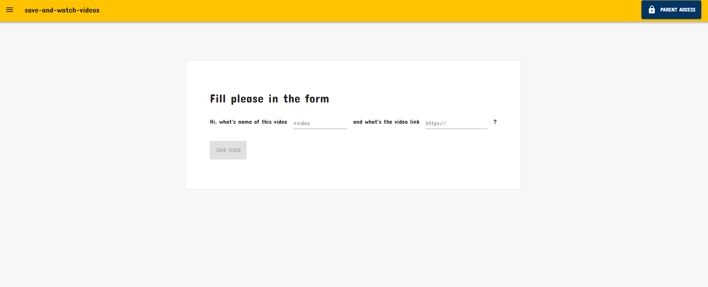
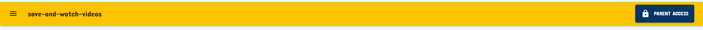

## Save-and-watch-videos





## Description
Is a basic video player application that let you save links and watch your video.
Inspiration: Nowadays, there's a lot of source of videos online and that's awesome, the problem is the ads, they may informative ads but not all of them some are really nasty, boring and repititve ads if  your child is happen to be  watching those videos that's another problem to solve it why not save those links and then play later?

## How to save link?
Ready your link and click parent access button fill in the form with video name and link itself then save.





## Technologies Used
Reactjs, Nextjs, material-ui, netlify 

## Roadmap
- [ ] Password required for adding new item
- [ ] Update item
- [x] Delete item
- [ ] Disable item
- [ ] Export data 
- [x] Responsive

## How to run locally?
First, run the development server:

```javascript
npm run dev
# or
yarn dev
```

Open [http://localhost:3000](http://localhost:3000) with your browser to see the result.